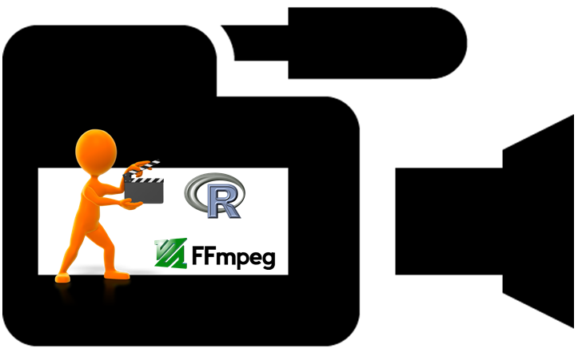
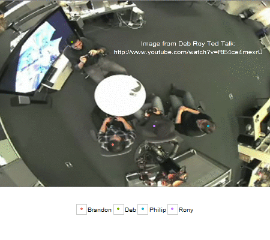

embodied
=======

[](https://travis-ci.org/trinker/embodied)

embodied is a package that provides video analysis tools for embodiement related tasks.



## Installation

To download the development version of embodied:


download the [zip ball](https://github.com/trinker/embodied/zipball/master) or [tar ball](https://github.com/trinker/embodied/tarball/master), decompress and run `R CMD INSTALL` on it, or use the **devtools** package to install the development version:


```r
# install.packages("devtools")

library(devtools)
#Install the development versions of slidify and its libraries
install_github('slidify', 'ramnathv', ref = 'dev')
install_github('slidifyLibraries', 'ramnathv', ref = 'dev')

install_github(c("reports", "embodied"), "trinker")
```

## Help
  
[Web Page](http://trinker.github.com/embodied/)      
[Package PDF Help Manual](https://dl.dropbox.com/u/61803503/embodied.pdf)      

## Contact

You are welcome to:
* submit suggestions and bug-reports at: <https://github.com/trinker/embodied/issues>
* send a pull request on: <https://github.com/trinker/embodied/>
* compose a friendly e-mail to: <tyler.rinker@gmail.com>

## Demonstrations

### Motion Path Example



For the script used to create this animated .gif [click here](https://github.com/trinker/embodied/blob/master/inst/example_plots/motion_path.md)

### Discourse Density Example


For the script used to create these discourse density plot [click here]()

