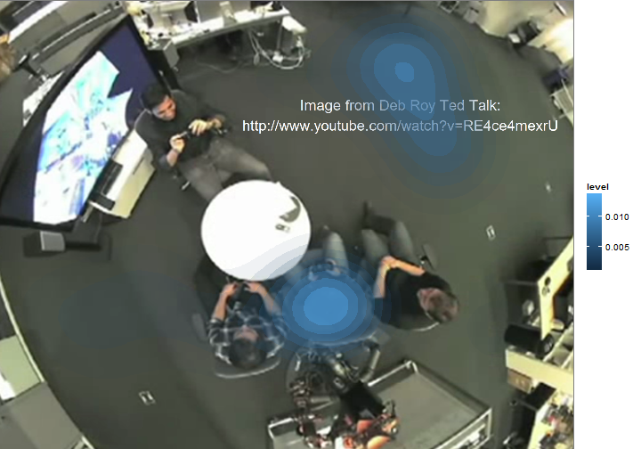
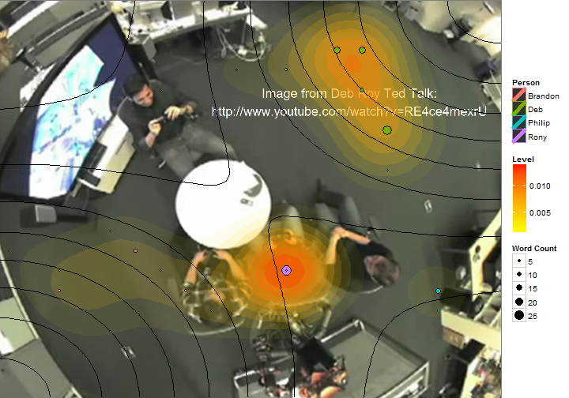

## Overview

The following short script allows us to generate a speech density imaging using [ggplot2](http://docs.ggplot2.org/current/) and the [embodied](https://github.com/trinker/embodied) package.


```r
## Create base image and prep data set
library(embodied); library(ggplot2); library(grid)
file <- system.file("extdata/deb_roy.png", package = "embodied")
base <- read_png(file, columns=20)
dat <- deb_complete[rep(1:nrow(deb_complete), deb_complete$wc), ]
head(dat)
```

```
##     id       time person coord                dialogue wc   x    y
## 4   04 00:11:22.0    Deb    i4     should be colliers.  3 6.5 15.5
## 4.1 04 00:11:22.0    Deb    i4     should be colliers.  3 6.5 15.5
## 4.2 04 00:11:22.0    Deb    i4     should be colliers.  3 6.5 15.5
## 9   09 00:11:24.5    Deb    r3 I strike quickly, being  4 9.5 16.5
## 9.1 09 00:11:24.5    Deb    r3 I strike quickly, being  4 9.5 16.5
## 9.2 09 00:11:24.5    Deb    r3 I strike quickly, being  4 9.5 16.5
```

## Plotting Density

### Basic Design


```r
base + 
    stat_density2d(data = dat, 
        aes(x=x, y=y, alpha=..level.., fill=..level..), size=2, bins=10, geom="polygon") + 
    scale_alpha(range = c(0.00, 0.5), guide = FALSE) 
```

 


### Change Density Colour


```r
base + 
    stat_density2d(data = dat, 
        aes(x=x, y=y, alpha=..level.., fill=..level..), size=2, bins=10, geom="polygon") + 
    scale_fill_gradient(low = "yellow", high = "red") +
    scale_alpha(range = c(0.00, 0.5), guide = FALSE) 
```

 


### Adding Black Sized Word Count Points


```r
base + 
    stat_density2d(data = dat, 
        aes(x=x, y=y, alpha=..level.., fill=..level..), size=2, bins=10, geom="polygon") + 
    scale_fill_gradient(low = "yellow", high = "red", name = "Level") +
    scale_alpha(range = c(0.00, 0.5), guide = FALSE) +
    geom_point(data = dat, aes(size = wc, x=x, y=y), colour="black") 
```

 


### Color Word Count Points by Person


```r
base + 
    stat_density2d(data = dat, 
        aes(x=x, y=y, alpha=..level.., fill=..level..), size=2, bins=10, geom="polygon") + 
    scale_fill_gradient(low = "yellow", high = "red", name = "Level") +
    scale_alpha(range = c(0.00, 0.5), guide = FALSE) +
    geom_point(data = dat, aes(size = wc, colour = person, x=x, y=y)) +
    guides(alpha=FALSE, 
        colour=guide_legend(title="Person"),
        size=guide_legend(title="Word Count"))   
```

 


### Add Black Desnity Curves and Point Outlines


```r
base + 
    stat_density2d(data = dat, 
        aes(x=x, y=y, alpha=..level.., fill=..level..), size=2, bins=10, geom="polygon") + 
    scale_fill_gradient(low = "yellow", high = "red", name = "Level") +
    scale_alpha(range = c(0.00, 0.5), guide = FALSE) +
    geom_density2d(colour="black", , show_guide=FALSE) +
    geom_point(data = dat, aes(size = wc, colour = person, x=x, y=y)) +
    geom_point(data = dat, aes(size = wc, colour = person, x=x, y=y), 
        shape = 1, colour = "black", guide=FALSE) +
    guides(alpha=FALSE, 
        colour=guide_legend(title="Person"),
        size=guide_legend(title="Word Count"))   
```

 


