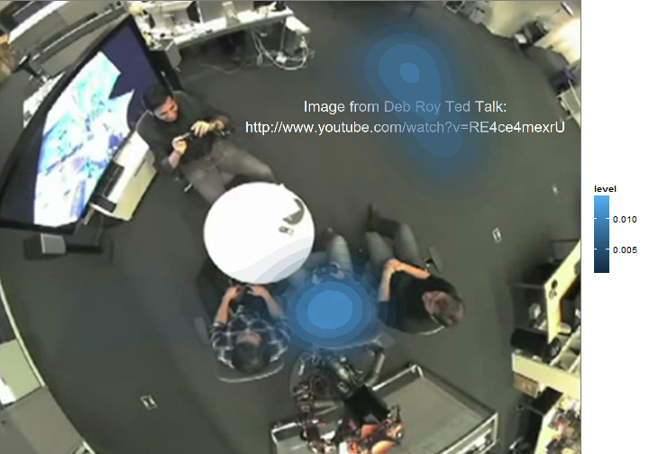
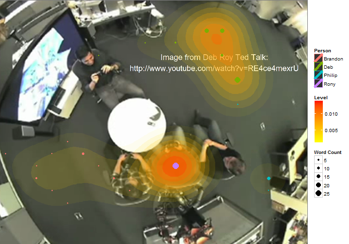
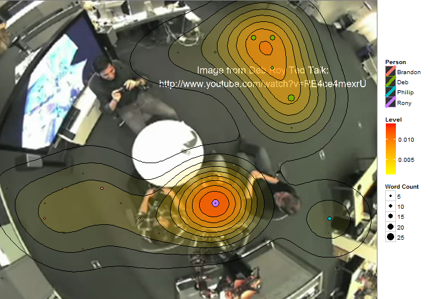

# Density 
<hr>
## Overview

The following short script allows us to generate a speech density imaging using [ggplot2](http://docs.ggplot2.org/current/) and the [embodied](https://github.com/trinker/embodied) package.


```r
## Create base image and prep data set
library(embodied); library(ggplot2); library(grid)
file <- system.file("extdata/deb_roy.png", package = "embodied")
base <- read_png(file, columns=20)
dat <- deb_complete[rep(1:nrow(deb_complete), deb_complete$wc), ]
head(dat)
```

```
##     id       time person coord                dialogue wc   x    y
## 4   04 00:11:22.0    Deb    i4     should be colliers.  3 6.5 15.5
## 4.1 04 00:11:22.0    Deb    i4     should be colliers.  3 6.5 15.5
## 4.2 04 00:11:22.0    Deb    i4     should be colliers.  3 6.5 15.5
## 9   09 00:11:24.5    Deb    r3 I strike quickly, being  4 9.5 16.5
## 9.1 09 00:11:24.5    Deb    r3 I strike quickly, being  4 9.5 16.5
## 9.2 09 00:11:24.5    Deb    r3 I strike quickly, being  4 9.5 16.5
```

## Plotting Density

### Basic Design


```r
base + 
    stat_density2d(data = dat, 
        aes(x=x, y=y, alpha=..level.., fill=..level..), size=2, bins=10, geom="polygon") + 
    scale_alpha(range = c(0.00, 0.5), guide = FALSE) 
```

 


### Change Density Colour


```r
base + 
    stat_density2d(data = dat, 
        aes(x=x, y=y, alpha=..level.., fill=..level..), size=2, bins=10, geom="polygon") + 
    scale_fill_gradient(low = "yellow", high = "red") +
    scale_alpha(range = c(0.00, 0.5), guide = FALSE) 
```

 


### Adding Black, Sized Word Count Points


```r
base + 
    stat_density2d(data = dat, 
        aes(x=x, y=y, alpha=..level.., fill=..level..), size=2, bins=10, geom="polygon") + 
    scale_fill_gradient(low = "yellow", high = "red", name = "Level") +
    scale_alpha(range = c(0.00, 0.5), guide = FALSE) +
    geom_point(data = dat, aes(size = wc, x=x, y=y), colour="black") 
```

 


### Color Word Count Points by Person


```r
base + 
    stat_density2d(data = dat, 
        aes(x=x, y=y, alpha=..level.., fill=..level..), size=2, bins=10, geom="polygon") + 
    scale_fill_gradient(low = "yellow", high = "red", name = "Level") +
    scale_alpha(range = c(0.00, 0.5), guide = FALSE) +
    geom_point(data = dat, aes(size = wc, colour = person, x=x, y=y)) +
    guides(alpha=FALSE, 
        colour=guide_legend(title="Person"),
        size=guide_legend(title="Word Count"))   
```

 


### Add Black Desnity Curves and Point Outlines


```r
base + 
    stat_density2d(data = dat, 
        aes(x=x, y=y, alpha=..level.., fill=..level..), size=2, bins=10, 
        geom="polygon") + 
    scale_fill_gradient(low = "yellow", high = "red", name = "Level") +
    scale_alpha(range = c(0.00, 0.5), guide = FALSE) +
    geom_density2d(data = dat, aes(x=x, y=y), colour="black", bins=10, 
        show_guide=FALSE) +
    geom_point(data = dat, aes(size = wc, colour = person, x=x, y=y)) +
    geom_point(data = dat, aes(size = wc, colour = person, x=x, y=y), 
        shape = 1, colour = "black", guide=FALSE) +
    guides(alpha=FALSE, 
        colour=guide_legend(title="Person"),
        size=guide_legend(title="Word Count"))   
```

 


### Density Lines Colored by Person


```r
base + 
    geom_density2d(data = dat, aes(x=x, y=y, color=person),
        bins=10, h=4, show_guide=FALSE) +
    geom_point(data = dat, aes(size = wc, colour = person, x=x, y=y)) 
```

 


# motion_path 
<hr>
## Overview

The following short script allows us to generate a motion path animated .mp4 and .gif.  I have chosen to access the tools of [ffmpeg](http://www.ffmpeg.org/ffmpeg.html) and [ImageMagick](http://www.imagemagick.org/script/index.php) directly via the `command` function; however, one could easily use the functions from Yiui Xie's [animation package](http://cran.r-project.org/web/packages/animation/index.html).

## Check ffmpeg/convert Access

First you may want to test if [ffmpeg](http://www.ffmpeg.org/ffmpeg.html) and [ImageMagick](http://www.imagemagick.org/script/index.php) are available and on your path:

```
library(embodied)
command("ffmpeg --version")
command("convert --version")
```

If you have command line access you will see something like:

```
> command("ffmpeg --version")
ffmpeg version N-59815-gb79bccb Copyright (c) 2000-2014 the FFmpeg developers
  built on Jan 13 2014 22:01:47 with gcc 4.8.2 (GCC)
  configuration: --enable-gpl --enable-version3 --disable-w32threads --enable-avisynth --enable-bzlib --enable-fontconfig --enable-frei0r --enable-gnutls --enable-iconv --enable-libass --enable-libbluray --enable-libcaca --enable-libfreetype --enable-libgsm --enable-libilbc --enable-libmodplug --enable-libmp3lame --enable-libopencore-amrnb --enable-libopencore-amrwb --enable-libopenjpeg --enable-libopus --enable-librtmp --enable-libschroedinger --enable-libsoxr --enable-libspeex --enable-libtheora --enable-libtwolame --enable-libvidstab --enable-libvo-aacenc --enable-libvo-amrwbenc --enable-libvorbis --enable-libvpx --enable-libwavpack --enable-libx264 --enable-libxavs --enable-libxvid --enable-zlib
  libavutil      52. 62.100 / 52. 62.100
  libavcodec     55. 48.101 / 55. 48.101
  libavformat    55. 23.103 / 55. 23.103
  libavdevice    55.  5.102 / 55.  5.102
  libavfilter     4.  1.100 /  4.  1.100
  libswscale      2.  5.101 /  2.  5.101
  libswresample   0. 17.104 /  0. 17.104
  libpostproc    52.  3.100 / 52.  3.100

> command("convert --version")
Version: ImageMagick 6.8.8-2 Q16 x64 2014-01-09 http://www.imagemagick.org
Copyright: Copyright (C) 1999-2014 ImageMagick Studio LLC
Features: DPC Modules OpenMP
Delegates: bzlib cairo freetype jbig jng jp2 jpeg lcms lqr pangocairo png ps rsvg tiff webp xml zlib
```

## Steps to Plot Animated Paths

### We can now:  

1. Read in the image(s) (set row and column numbers)    
2. Create a function (`pp`) that plots the poth (animates the sequence)    
3. Plot multiple .pngs files showing the paths    
4. Stitch the multiple .pngs into a .mp4 or animated .gif.     

## Animated Path Script

```
library(embodied); library(grid); library(ggplot2)

dat <- grid_coord(deb_long, 20)
file <- system.file("extdata/deb_roy.png", package = "embodied")
base <- read_png(file, 20)
dir.create("out")

ids <- as.character(unique(dat[, "id"]))
pp <- function() {
    for (i in 1:length(ids)) {
       png(sprintf("out/img-%s.png", pad(1:length(ids))[i]), width=450, height = 400)
        if (i == 1) {
            print(base + 
                geom_point(
                    data = dat[dat[, "id"] %in% ids[1:i], ], 
                    aes(group = person, 
                        colour=person), 
                    size = 2) + 
                theme(legend.position="bottom", 
                    plot.margin=unit(c(0,0,1,-1), "cm"), 
                    legend.title=element_blank(), 
                    axis.title.x = element_blank())) 
        } else {
            print(base + 
                geom_point(data = dat[dat[, "id"] %in% ids[i], ], 
                    aes(group = person, 
                        colour=person), 
                    size = 2) +
                geom_path(data = dat[dat[, "id"] %in% ids[1:i], ], 
                    aes(group = person, colour=person)) + 
                theme(legend.position="bottom", 
                    plot.margin=unit(c(0,0,1,-1), "cm"), 
                    legend.title=element_blank(), 
                    axis.title.x = element_blank())) 
        }
       dev.off()
    }
}

pp()

## Assuming you have ImageMagick and ffmpeg install and on your path
command("ffmpeg -r 5 -i out/img-%02d.png -c:v libx264 -r 30 -pix_fmt yuv420p out/out.mp4")
command("convert -delay 10 -loop 0 out/*.png out/out.gif") 
```

